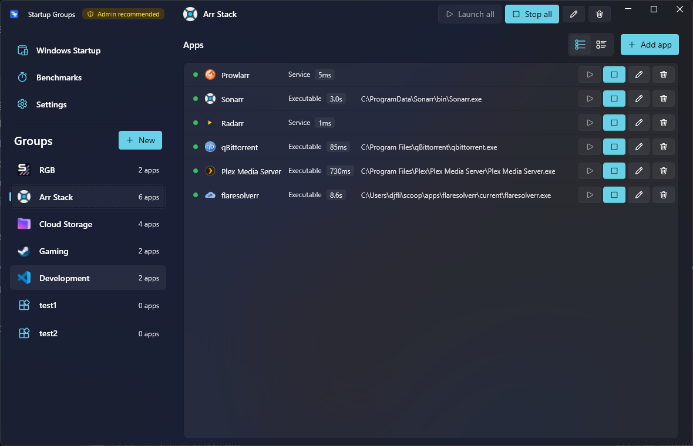

# Salvo

A Windows launcher that fires groups of apps in coordinated waves — with adaptive readiness detection, wave-parallel orchestration, and built-in launch benchmarking.

> **Stop waiting on Slack to be ready before clicking your IDE.** Define a group, hit launch, and your full work environment comes up in the right order without you babysitting it.



## Features

- **Group your apps** — define named groups (e.g. *Work*, *Gaming*, *Streaming*) with the apps that belong together.
- **Wave-parallel launch** — apps with no dependency launch concurrently. `DelayAfterSeconds > 0` closes a wave; the next wave waits for `max(time_until_all_ready, delay)`.
- **Adaptive readiness detection** — four parallel probes per app (input-idle, main-window-found, CPU/IO quiet, service-running). First-wins, no per-app config required.
- **Launch benchmarking** — every launch is timed and stored. Cold-vs-warm tracking, bottleneck analysis, history view in-app.
- **Drag-to-reorder** apps within a group.
- **Tray-resident** with quick-launch from the system tray.
- **Auto-start with Windows** via Task Scheduler (elevation-aware).
- **Windows Startup tab** to inspect/edit existing Registry `Run` keys and Task Scheduler entries.
- **Service control** — start/stop Windows services as part of a group, via a dedicated UAC-elevated helper.
- **Themes** — system / light / dark, Fluent (WPF-UI).
- **Localized** — 10 languages out of the box (en, fr, de, ja, ru, ar, he, th, hi, more).

## Install

| Channel | Status | How |
| --- | --- | --- |
| **GitHub direct download** | 🟢 live | Download the latest [`.appinstaller`](https://github.com/beelzer/salvo/releases/latest) and double-click. Windows App Installer handles install + silent background updates. |
| **Microsoft Store** | 🟡 coming soon | Reserved app identity; certification pending. |
| **winget** | 🟡 coming soon | `winget install Salvo` once the manifest is approved. |
| **Chocolatey** | 🟡 coming soon | `choco install salvo` once the package is approved. |
| **Scoop** | 🟡 coming soon | Bucket entry pending. |

The MSIX install runs in a packaged-app context with the full-trust desktop bridge — settings live at `%AppData%\Salvo\`, registry / Task Scheduler integration works as it does for any traditional Win32 app. Auto-update is silent and Windows-driven; the in-app **Check for updates** button surfaces release notes for users who want to see what's changing.

> Until a code-signing cert is in place, the GitHub download installs only via Windows **Developer Mode** (Settings → Privacy & security → For developers). Once the cert is wired up, sideload installs work for everyone, and the Microsoft Store / winget / Chocolatey / Scoop entries light up. SmartScreen reputation rebuilds over a few weeks regardless of cert tier.

## Build from source

Requirements:
- **Windows 10/11**
- **.NET 10 SDK** (see [global.json](global.json))
- **Windows 10/11 SDK** (only needed to build the MSIX — provides `MakeAppx.exe` and `SignTool.exe`)

```powershell
# clone
git clone https://github.com/beelzer/salvo.git
cd salvo

# build
dotnet build Salvo.slnx -c Release

# run the WPF app
dotnet run --project src/Salvo.App -c Release

# run the test suite
dotnet test
```

To build the MSIX package locally (unsigned — installable via Windows Developer Mode):

```powershell
./installer/Msix/build.ps1
```

## Architecture

Three projects under [src/](src/):

| Project | Role |
| --- | --- |
| **Salvo.App** | WPF UI (WPF-UI Fluent theme, CommunityToolkit.Mvvm). Views, ViewModels, tray, settings, drag-reorder. |
| **Salvo.Core** | Domain model, launch orchestration, Win32 interop, readiness probes, SQLite benchmark store, JSON config. |
| **Salvo.Elevator** | Tiny admin helper invoked via UAC for privileged ops (service start/stop, machine-scope Run keys). |

Tests live in [tests/Salvo.Core.Tests](tests/Salvo.Core.Tests/) (xUnit + FluentAssertions).

### Tech stack

.NET 10 · WPF · WPF-UI · CommunityToolkit.Mvvm · Serilog · Microsoft.Data.Sqlite · MSIX (MakeAppx)

## Cutting a release

1. Bump `<Version>` in [Directory.Build.props](Directory.Build.props).
2. Commit and push to `main`.
3. Tag the commit with a matching `vX.Y.Z` and push the tag:

   ```bash
   git tag v0.2.0
   git push origin v0.2.0
   ```

4. The [release workflow](.github/workflows/release.yml) will build the MSIX + `.appinstaller`, run the tests, and publish a GitHub release with the installer attached. App Installer picks it up on the next check.

## Roadmap

See [ROADMAP.md](ROADMAP.md) for in-flight work, planned features, and migration notes.

## License

[MIT](LICENSE) © 2026 beelzer
